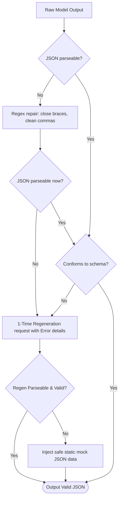

# 🧠 AI Service Engine & Validation Pipeline Manual

This document details the provider abstractions, validation logic, safety filtering, and telemetry logging architecture that powers FitSage AI.

---

## 1. Provider Decoupling Abstraction
To avoid tight coupling to the Google Gemini SDK, the system uses the **Provider Pattern**:

- **[BaseAIProvider](file:///c:/Users/revad/OneDrive/Desktop/FitSage_AI/backend/services/providers.py)**: An abstract base class defining the `generate_content(prompt, system_instruction, response_schema=None)` interface.
- **[GeminiProvider](file:///c:/Users/revad/OneDrive/Desktop/FitSage_AI/backend/services/providers.py)**: The concrete implementation that binds to `google-generativeai` and processes calls using the credentials and model constraints loaded from `.env`.

This makes it easy to switch to OpenAI or Anthropic providers in the future without changing application route handlers.

---

## 2. Dynamic Prompt Assembly
Prompts are assembled inside **[prompt_builder.py](file:///c:/Users/revad/OneDrive/Desktop/FitSage_AI/backend/services/prompt_builder.py)**. Templates inject the user's latest metrics, limitations, and preferences:

- **Workout Builder**: Injects training duration, equipment access, injuries, and fitness levels, demanding structured JSON conforming to `WorkoutSchema`.
- **Meal Builder**: Injects targets, Indian dish preferences, dietary constraints, allergies, and daily Rupee budgets, demanding structured JSON conforming to `MealSchema`.

---

## 3. Physical Safety & Health Sanity Checkers
Before returning plans, they pass through **[safety_checker.py](file:///c:/Users/revad/OneDrive/Desktop/FitSage_AI/backend/services/safety_checker.py)**:

- **Joint-Injury Scans**: If the user's profile lists joints pain (e.g. "Knee Pain", "Shoulder Injury"), the safety layer intercepts joint-loading exercises in the generated JSON. For instance, squat variants are swapped with low-impact glute bridges.
- **Weight Loss Rate Barrier**: Blocks extreme weight loss requests. If a user seeks a plan to drop weight faster than 1.5 kg per week, the checker modifies targets to a safe rate of 0.5–1.0 kg/week and injects safety warnings.

---

## 4. JSON Schema Validation & Repair Pipeline
Gemini responses are parsed by **[response_validator.py](file:///c:/Users/revad/OneDrive/Desktop/FitSage_AI/backend/services/response_validator.py)**.



- **Regex Repairs**: Closes dangling curly braces/brackets, removes invalid trailing commas, and strips Markdown code block wrappers (` ```json `).
- **1-Retry Regeneration**: If validation fails, it triggers a retry to Gemini with details about the validation failure.
- **Safe Fallback**: If regeneration fails, it returns a static, structurally valid JSON template to prevent application crashes.

---

## 5. Persistent Conversation Memory
Multi-turn context is managed through a sliding memory window:
- **Last 5-turn History**: Active logs are stored in the `coach_chat` table.
- **Persistent Summaries**: When histories exceed 5 turns, the orchestrator asks Gemini to summarize the historical logs. The summary is saved in `coach_summary` and injected as system instruction context for subsequent messages.

---

## 6. Telemetry & Metrics Logging
AI requests are logged to **[logs/ai_metrics.log](file:///c:/Users/revad/OneDrive/Desktop/FitSage_AI/backend/logs/ai_metrics.log)** in JSON Lines format:

```json
{
  "timestamp": "2026-07-16T13:00:00Z",
  "endpoint": "/workout/generate",
  "latency_seconds": 1.45,
  "cache_status": "miss",
  "retry_count": 0,
  "validation_failure": false
}
```

- **Sensitive Data Isolation**: Profile details, API keys, names, and emails are stripped from log records.
- **Cache Hits**: Latency metrics for cache hits are recorded as `0.0s`.
