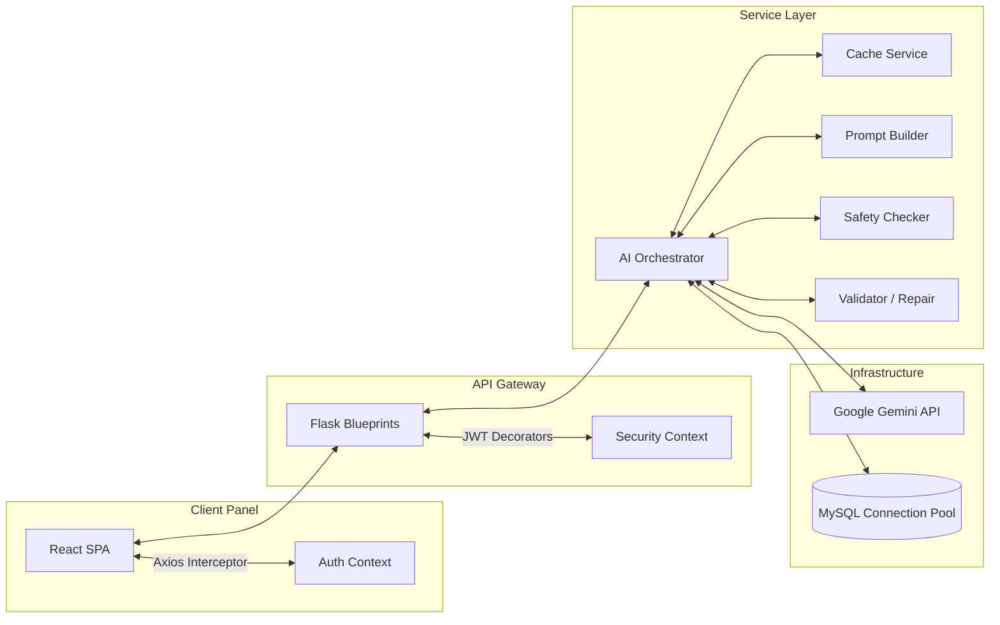
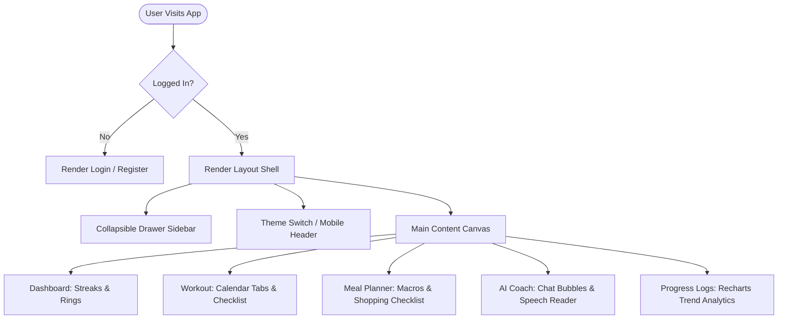
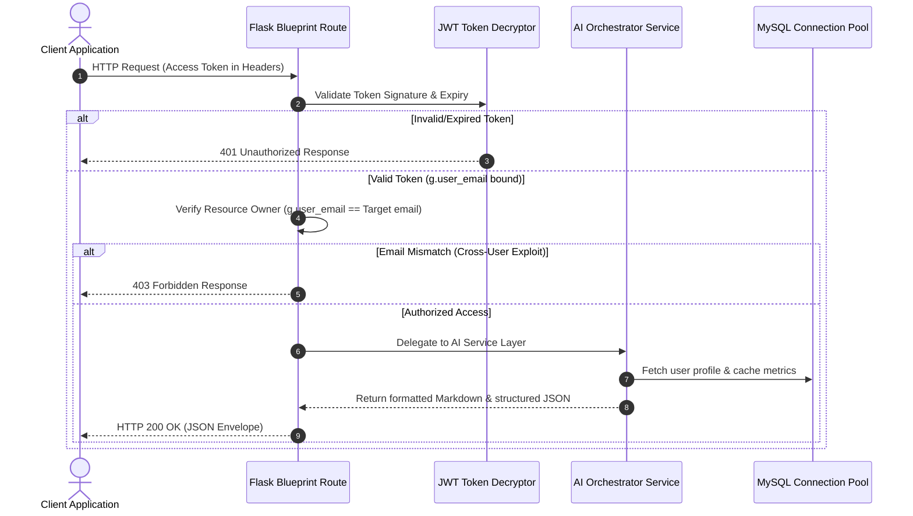
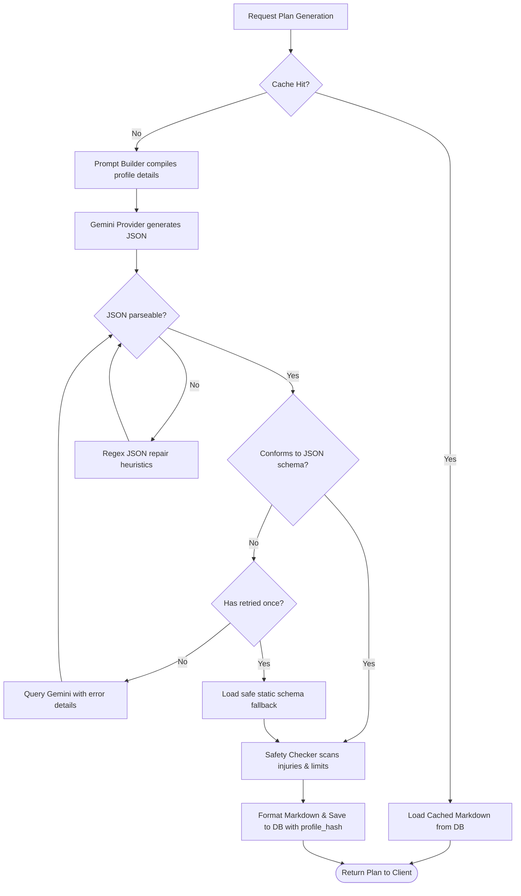

# 🏗️ Architecture Design Specification

This document maps out the end-to-end software architecture, frontend state layouts, backend request controls, AI processing pipes, and database relationships of the FitSage AI platform.

---

## 1. High-Level System Architecture



---

## 2. Frontend State & Navigation Flow

The frontend utilizes a Centralized State wrapper mapping JWT authentication guards, Toast Alerts, and Theme togglers:



---

## 3. Backend Request Lifecycle & Blueprint Routing



---

## 4. AI Processing Pipeline

When the cache misses or the user forces regeneration, the AI engine processes prompts using validation, safety interceptors, and repairs:



---

## 5. Database Schema Relationships (ERD)

```mermaid
erDiagram
    USERS ||--o{ WORKOUTS : generates
    USERS ||--o{ MEALS : generates
    USERS ||--o{ PROGRESS_LOGS : records
    USERS ||--o{ COACH_CHAT : chats
    USERS ||--|| COACH_SUMMARY : summarizes
    
    USERS {
        int id PK
        string name
        string email UNIQUE
        string password
        int age
        string gender
        int height
        int weight
        string goal
        string diet
        int budget
        string activity
        string equipment
        string role
        string fitness_level
        text allergies
        text injuries
        int workout_duration
    }
    
    WORKOUTS {
        int id PK
        int user_id FK
        text workout_plan
        string profile_hash
        timestamp created_at
    }

    MEALS {
        int id PK
        int user_id FK
        text meal_plan
        int calories
        int protein
        int cost
        string profile_hash
        timestamp created_at
    }

    PROGRESS_LOGS {
        int id PK
        int user_id FK
        float weight
        int water_intake
        int calories_consumed
        boolean workout_completed
        date date
        timestamp created_at
    }

    COACH_CHAT {
        int id PK
        int user_id FK
        text user_message
        text ai_response
        timestamp created_at
    }

    COACH_SUMMARY {
        int user_id PK, FK
        text summary
        timestamp updated_at
    }
```

---

## 6. Layout Shell & Coding Patterns
- **Atomic UI Grid Systems**: The layouts scale dynamically through flex/grid boxes mapped to viewport dimensions. No hardcoded pixel widths are used in core canvas components.
- **Provider Pattern**: AI Provider interfaces are decoupled from underlying libraries, allowing the application to replace the Gemini SDK with OpenAI or Claude libraries by editing a single concrete constructor.
- **Checked Checklists**: User checklists (workouts, groceries) leverage local state mapping coordinates, preventing database roundtrips for minor local visual updates.
