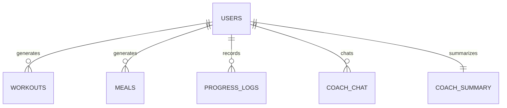

# 🗄️ Database Schema & Invalidation Cache Specification

The MySQL Database stores user credentials, logs history, chat transcripts, and cached plans.

---

## 1. Entity ER Diagram



---

## 2. Table Column Schemas

### `users`
Stores personalization profiles, authorization tags, and credentials.
- **Primary Key**: `id` (INT Auto Increment)
- **Indexes**:
  - `email` (VARCHAR(120) UNIQUE) — Enables O(1) query speeds for credential checks.

| Column Name | Data Type | Nullable | Default | Description / Purpose |
| :--- | :--- | :--- | :--- | :--- |
| `id` | INT | No | *Auto* | Unique user primary identifier. |
| `name` | VARCHAR(100) | No | | User display name. |
| `email` | VARCHAR(120) | No | | Login username (Unique). |
| `password` | VARCHAR(200) | No | | Bcrypt password hash. |
| `age` | INT | Yes | NULL | Profile metric for calorie ranges. |
| `gender` | VARCHAR(20) | Yes | NULL | Profile metric for calorie ranges. |
| `height` | INT | Yes | NULL | Height in centimeters (for BMI calculations). |
| `weight` | INT | Yes | NULL | Weight in kilograms. |
| `goal` | VARCHAR(100) | Yes | NULL | Target goal string. |
| `diet` | VARCHAR(100) | Yes | NULL | Vegetarian, vegan, or non-veg limits. |
| `budget` | INT | Yes | NULL | Indian Rupee grocery price limit. |
| `activity` | VARCHAR(100) | Yes | NULL | Activity multipliers. |
| `equipment` | VARCHAR(100) | Yes | NULL | Dumbbells, Kettlebells, or Full Gym. |
| `role` | VARCHAR(50) | No | "user" | RBAC tag: "user", "admin", "coach", "nutritionist". |
| `fitness_level` | VARCHAR(50) | Yes | "Beginner" | Personalization: Beginner, Intermediate, Advanced. |
| `allergies` | TEXT | Yes | NULL | Nutrition filters. |
| `injuries` | TEXT | Yes | NULL | Joint injury adapters. |
| `workout_duration`| INT | Yes | 45 | Target training session mins. |

---

### `workouts`
Caches generated training programs.
- **Primary Key**: `id`
- **Foreign Keys**:
  - `user_id` (References `users.id` ON DELETE CASCADE)

| Column Name | Data Type | Nullable | Default | Description / Purpose |
| :--- | :--- | :--- | :--- | :--- |
| `id` | INT | No | *Auto* | Primary key. |
| `user_id` | INT | No | | Linked user. |
| `workout_plan` | TEXT | No | | Formatted Markdown plan text. |
| `profile_hash` | VARCHAR(64)| Yes | NULL | SHA-256 hash of profile fields used for cache checks. |
| `created_at` | TIMESTAMP | No | CURRENT_TIMESTAMP | Log date. |

---

### `meals`
Caches generated nutrition menus.
- **Primary Key**: `id`
- **Foreign Keys**:
  - `user_id` (References `users.id` ON DELETE CASCADE)

| Column Name | Data Type | Nullable | Default | Description / Purpose |
| :--- | :--- | :--- | :--- | :--- |
| `id` | INT | No | *Auto* | Primary key. |
| `user_id` | INT | No | | Linked user. |
| `meal_plan` | TEXT | No | | Formatted Indian meal menu text. |
| `profile_hash` | VARCHAR(64)| Yes | NULL | SHA-256 hash of profile fields used for cache checks. |
| `created_at` | TIMESTAMP | No | CURRENT_TIMESTAMP | Log date. |

---

### `progress_logs`
Records user tracking telemetry.
- **Primary Key**: `id`
- **Foreign Keys**:
  - `user_id` (References `users.id` ON DELETE CASCADE)
- **Indexes**:
  - `user_date_idx` (Composite: `user_id`, `date` UNIQUE) — Prevents duplicate logs.

| Column Name | Data Type | Nullable | Default | Description / Purpose |
| :--- | :--- | :--- | :--- | :--- |
| `id` | INT | No | *Auto* | Primary key. |
| `user_id` | INT | No | | Linked user. |
| `weight` | FLOAT | No | | Measured weight in kg. |
| `water_intake` | INT | No | 0 | Milliliters consumed. |
| `calories_consumed`| INT | No | 0 | Kilocalories consumed. |
| `workout_completed`| BOOLEAN | No | FALSE | Logged workout completion. |
| `date` | DATE | No | | Target tracking date. |
| `created_at` | TIMESTAMP | No | CURRENT_TIMESTAMP | Record created timestamp. |

---

### `coach_chat`
Logs conversation logs.
- **Primary Key**: `id`

| Column Name | Data Type | Nullable | Default | Description / Purpose |
| :--- | :--- | :--- | :--- | :--- |
| `id` | INT | No | *Auto* | Primary key. |
| `user_id` | INT | No | | Linked user. |
| `user_message` | TEXT | No | | Prompt query. |
| `ai_response` | TEXT | No | | Generated answer. |
| `created_at` | TIMESTAMP | No | CURRENT_TIMESTAMP | Log date. |

---

### `coach_summary`
Caches persistent thread contexts.
- **Primary Key**: `user_id` (References `users.id` ON DELETE CASCADE)

| Column Name | Data Type | Nullable | Default | Description / Purpose |
| :--- | :--- | :--- | :--- | :--- |
| `user_id` | INT | No | | Linked user ID (PK). |
| `summary` | TEXT | No | | Condensed summary of thread context. |
| `updated_at` | TIMESTAMP | No | CURRENT_TIMESTAMP | Sync date. |

---

## 3. Profile-Aware Invalidation Caching Strategy

To minimize Gemini API load times and costs, generated plans are cached in the database. 

However, standard time-based expiry is insufficient: if a user changes their weight, goal, activity level, or training equipment, their active workout/meal plan must be invalidated immediately.

### Caching Pipeline
1. **Hash Generation**: When generating a plan, we calculate a stable SHA-256 hash using the user's current profile variables:
   ```python
   hash_input = f"{weight}-{goal}-{diet}-{budget}-{activity}-{equipment}-{fitness_level}-{allergies}-{injuries}-{workout_duration}"
   profile_hash = hashlib.sha256(hash_input.encode()).hexdigest()
   ```
2. **Cache Verification**: When a user visits the page, we retrieve the cached plan and compare its stored `profile_hash` against the user's current profile hash.
3. **Invalidation**: If the hashes mismatch, the cache misses, and a new plan is generated and saved.

---

## 4. Idempotent Migration Architecture
All database upgrades are checked before execution inside `backend/database.py`:
- Checks table existence via `SHOW TABLES LIKE '...'` before creation.
- Checks column names via `SHOW COLUMNS FROM ... LIKE '...'` before running `ALTER TABLE`.
- This ensures server boots are non-breaking and can run safely multiple times.
