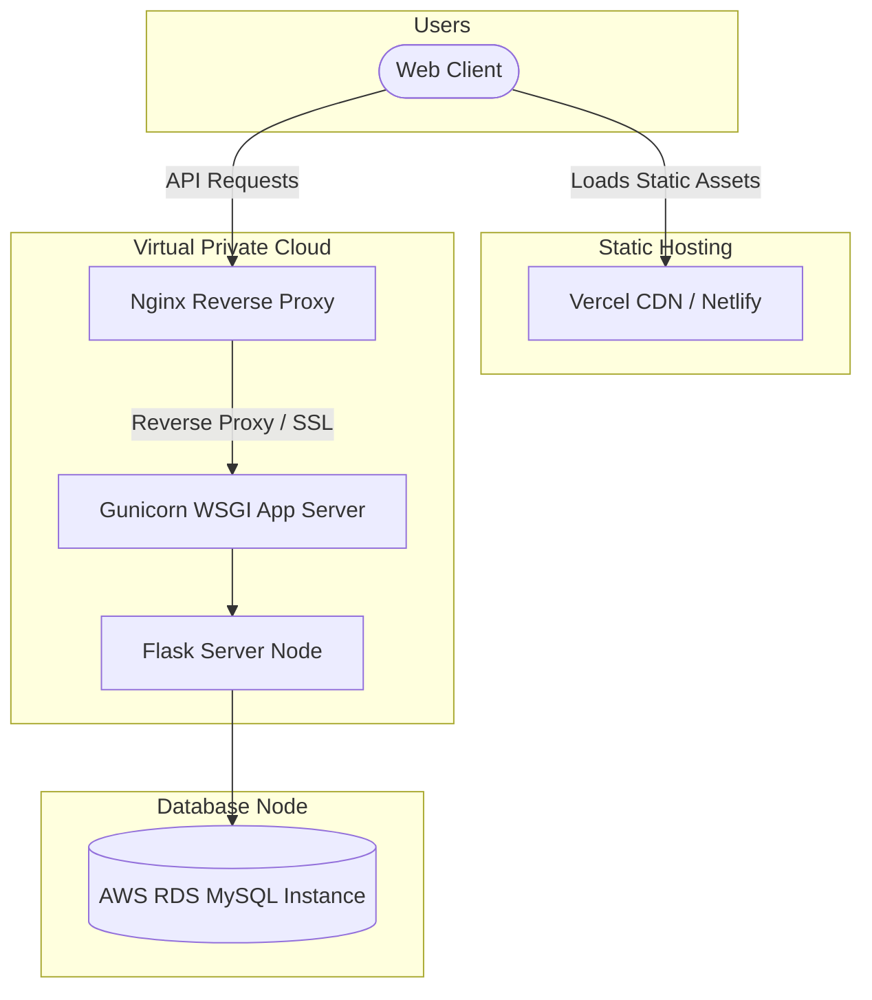

# 🚀 Production Deployment Reference Manual

This guide describes how to deploy the FitSage AI platform to production-grade cloud infrastructure.

---

## 1. Production Deployment Architecture



---

## 2. Frontend Deployment (Static Hosting)

The frontend compiles to standard static HTML, CSS, and JS assets.

### Vercel / Netlify Setup
1. **Repository Link**: Connect your repository to the hosting platform.
2. **Build Settings**:
   - **Framework Preset**: `Vite` (or `Other` / `Create React App`)
   - **Build Command**: `npm run build`
   - **Output Directory**: `dist`
3. **Environment Variables**:
   - **`VITE_API_URL`**: Point this to your production backend URL (e.g., `https://api.fitsage.com`).

---

## 3. Backend Deployment (WSGI & Virtual Server)

Do not run the Flask development server (`python app.py`) in production. Use a WSGI server like **Gunicorn**.

### Step-by-Step Server Setup (Ubuntu VPS example)
1. **Install System Dependencies**:
   ```bash
   sudo apt update
   sudo apt install python3-pip python3-venv mysql-client nginx
   ```
2. **Clone and Setup Virtual Env**:
   ```bash
   git clone https://github.com/username/fitsage-ai.git /var/www/fitsage-ai
   cd /var/www/fitsage-ai/backend
   python3 -m venv venv
   source venv/bin/activate
   pip install -r requirements.txt
   pip install gunicorn
   ```
3. **Setup Nginx Reverse Proxy**:
   Create `/etc/nginx/sites-available/fitsage` and configure it to proxy requests to Gunicorn (running on `localhost:8000`).
4. **Start Backend Service**:
   Run Gunicorn as a systemd background service:
   ```bash
   gunicorn --workers 3 --bind 127.0.0.1:8000 app:app
   ```

---

## 4. Production Database Deployment (MySQL / RDS)
1. **AWS RDS Setup**: Provision a MySQL instance (v8.0+) with multi-AZ replication for high availability.
2. **IP Access Control**: Restrict access to database ports; permit connections only from the backend app server's security group.
3. **Backups Schedule**: Enable daily snapshots with a 7-to-30 day retention policy.

---

## 5. Production Operations Checklist

Before launching, verify the following configuration items:

- [ ] **DEBUG Flag**: Verify `debug=False` is set in your server configuration to prevent stack traces from displaying on API errors.
- [ ] **Secrets**: Ensure `JWT_SECRET` and `GEMINI_API_KEY` are loaded from system environment variables, not hardcoded in files.
- [ ] **SSL / HTTPS**: Verify SSL certificates are active on both the frontend and backend domains.
- [ ] **CORS Origins**: Limit `cors_allowed_origins` to your production frontend domain (do not use `*`).
- [ ] **Token Expiry**: Ensure access tokens are set to expire within 15–30 minutes, and refresh tokens expire in 7–30 days.
- [ ] **DB Connection Pool**: Verify `pool_size` is configured to handle your expected concurrent user load.
