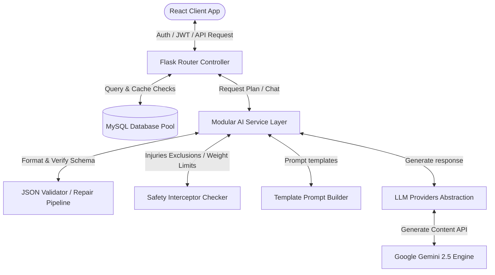

# 🥗 FitSage AI — Intelligent Personalized Fitness Planner

[](LICENSE)
[](backend)
[](frontend)
[](backend/services)

FitSage AI is a premium, SaaS-ready, context-aware personalized workout planner, Indian meal generator, and interactive fitness assistant. Built using the **Google Gemini API**, it crafts daily recommendations, multi-day training templates, and nutrition schedules adapted to user profiles, budgets, allergies, and joint injuries.

---

## 📸 Application Showcase

> [!NOTE]
> *Screenshots showcase the unified Light/Dark design system implemented in Phase 4.*

| **Responsive Dashboard** | **Weekly Workout Calendar** |
|:---:|:---:|
|  |  |
| *Stats meters, Streaks, & Quicklogs* | *Mon-Sun Calendar with injury checks* |

---

## ⚡ Feature Comparison Table

| Feature Dimension | Typical Academic AI Projects | **FitSage AI Platform** |
| :--- | :--- | :--- |
| **AI Payload Structure** | Raw unvalidated text strings | **Validated schema-aligned JSON objects** |
| **Caching Model** | Makes costly duplicate API calls | **Profile-aware invalidation caching** |
| **Safety Sanity Check** | Relies solely on prompt instruction | **Hard physical injury filters & weight guards** |
| **Centralization Layer** | Hardcoded configs in routes | **Modular dynamic provider abstraction layer** |
| **Conversational Memory** | No memory across page refreshes | **Persistent DB summaries & last 5-turn history** |
| **UI Aesthetics** | Basic plain tables & lists | **Dark/Light SaaS theme templates & Recharts** |

---

## 🏗️ High-Level System Architecture



---

## 📁 Repository Directory Structure

```
FitSage_AI/
├── backend/                    # Python Flask Server Backend
│   ├── routes/                 # Blueprint HTTP Router Controllers
│   ├── schemas/                # Centralized JSON Schema structures
│   ├── services/               # Modular AI Service Engines
│   │   ├── providers.py        # BaseAIProvider & GeminiProvider
│   │   ├── prompt_builder.py   # Reusable Prompt template builders
│   │   ├── safety_checker.py   # Injury adapters & weight guards
│   │   ├── response_validator.py # Schema checkers & JSON repair pipelines
│   │   ├── cache_service.py    # Profile-aware caching checks
│   │   └── ai_logger.py        # Performance logging telemetry
│   ├── app.py                  # Server Bootstrapping Gateway
│   ├── database.py             # MySQL Connection Pool & Migrations
│   └── .env.example            # Environment variables configuration
└── frontend/                   # React Vite Client Frontend
    ├── src/
    │   ├── components/
    │   │   └── ui/             # Reusable Atomic Design UI components
    │   ├── context/            # Auth, Theme, and Toast Alert Contexts
    │   ├── pages/              # Responsive Application pages
    │   └── main.jsx            # React Bootstrap entry point
    └── package.json            # NPM dependencies list
```

---

## 🛠️ Local Installation & Setup

### Prerequisites
- Python 3.9+
- Node.js 18+
- MySQL Server instance running locally

### 1. Database Configuration
1. Initialize a database instance named `fitsage_db`.
2. The backend startup migrator will automatically create and alter all table relations.

### 2. Backend Setup
```bash
# Navigate to backend
cd backend

# Create Virtual Environment
python -m venv venv
venv\Scripts\activate

# Install Dependencies
pip install -r requirements.txt

# Configure Environment Variables
copy .env.example .env
# Edit .env and enter your credentials (DB passwords, GEMINI_API_KEY)

# Run migrations and start server
python app.py
```

### 3. Frontend Setup
```bash
# Navigate to frontend
cd ../frontend

# Install node dependencies
npm install

# Start Local Dev Server
npm run dev
```

---

## 📈 Deployment Roadmap
- [x] Phase 1: Robust DB Pooling (MySQL connection pool setup)
- [x] Phase 2: Role-based Authentication (Access/Refresh JWT cycles)
- [x] Phase 3: Validated AI Engine (JSON Validation, Caching, Safety, Memory)
- [x] Phase 4: Modern SaaS UI (Light/Dark toggles, Recharts, ChatGPT Coach)
- [ ] Phase 5: Production Staging Deployments (AWS / Docker virtualization)

---

## 📄 License
This project is licensed under the MIT License - see [LICENSE](LICENSE) for details.

## 👤 Author
Designed, built, and polished by Revadi Naga Sai Jaswanth
