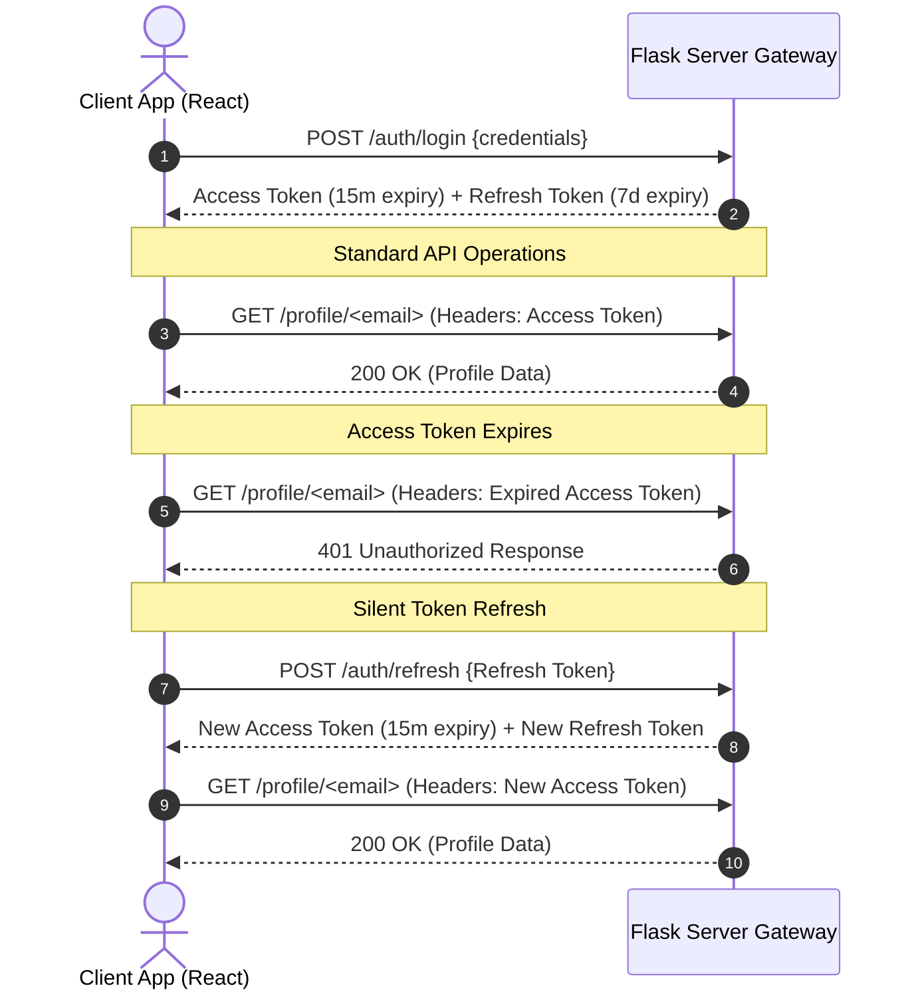

# 🔒 Security Architecture Reference Manual

This document details the security practices, authorization workflows, and user data isolation layers of the FitSage AI platform.

---

## 1. Password Hashing & Credentials Encryption
- **Algorithm**: **Bcrypt** is used for secure password hashing.
- **Implementation**: Hashing runs with a default work factor of 12 rounds. Plaintext credentials are never saved to database columns.
- **Salt Generation**: Unique salts are generated per user and combined during registration.

---

## 2. JWT Session Token Lifecycle



- **Access Token**: Short-lived (15 minutes). Transmitted via the `Authorization: Bearer <token>` header. Contains name, email, and roles in the JWT payload.
- **Refresh Token**: Long-lived (7 days). Stored securely. Used only to request a new access token.
- **Silent Refresh**: The frontend Axios client interceptor automatically catches `401` errors and requests a token refresh. If the refresh request fails (e.g., refresh token has expired), the user is gracefully logged out.

---

## 3. Cross-User Data Isolation Guards
To prevent **Insecure Direct Object Reference (IDOR)** vulnerabilities, the backend verifies resource ownership before returning data:

1. **JWT Verification**: The `@token_required` decorator decodes the bearer token, verifies its signature, checks expiration, and binds the token's email payload to `g.user_email`.
2. **Ownership Check**: Resource endpoints compare `g.user_email` against the requested resource's email (e.g., in `/profile/<email>`):
   ```python
   if g.user_email != target_email:
       return jsonify({"error": "You do not have permission to access this resource."}), 403
   ```
3. **Outcome**: Users are prevented from viewing or modifying another user's profile, workout logs, or meal plans, even if they have a valid session token.

---

## 4. Role-Based Access Control (RBAC)
Role information is embedded in the JWT payload:
- **Default Role**: `"user"`
- **Available Roles**: `"user"`, `"admin"`, `"coach"`, `"nutritionist"`
- **Authorization Helper**: An `@admin_required` decorator checks the JWT payload:
  ```python
  if g.user_role != 'admin':
      return jsonify({"error": "Admin privileges required."}), 403
  ```

---

## 5. Input Prompt Sanitization
To prevent prompt injection attacks, the backend sanitizes user messages:
- **Character Stripping**: Removes control codes and escapes HTML tags.
- **Length Limits**: Truncates inputs to 500 characters.
- **Personalization Scoping**: Prompts are wrapped in strict system templates to ensure the AI responds only to health, training, and nutrition topics.
